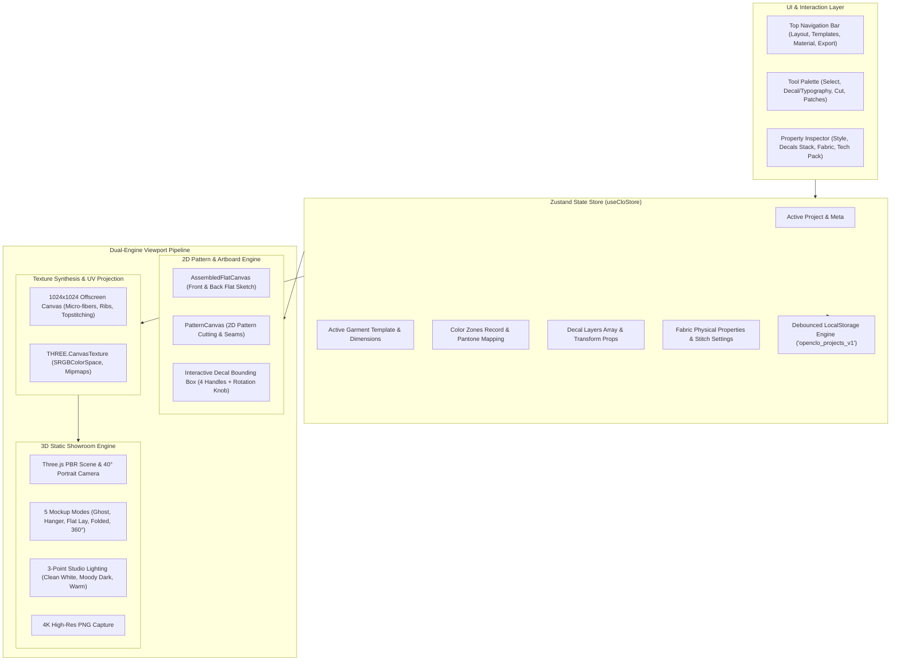
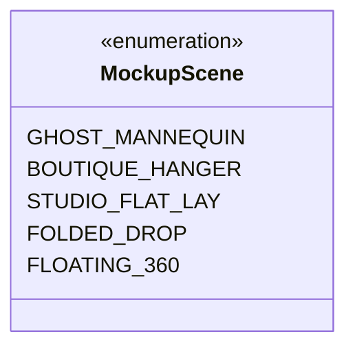

# OpenCLO Technical & Garment Engineering Specification (v2.0)

**Document Status:** Production Approved  
**Classification:** Fashion CAD Architecture & Commercial Apparel Engineering  
**Version:** 2.0.0-PRO  
**Benchmark Standard:** Uniqlo LifeWear & GU Japan Commercial Streetwear Standards  
**Target Platform:** Web-native (React 19, TypeScript, HTML5 Canvas 2D, Three.js WebGL)

---

## 1. Executive Overview & Design Philosophy

Commercial garment CAD systems (CLO3D, Marvelous Designer, Browzwear V-Stitcher) traditionally force users into full humanoid mannequin simulators and erratic XPBD/PBD cloth physics solvers. For commercial fashion designers, technical apparel patternmakers, and streetwear brands, this approach introduces unnecessary friction: distorted garment fits, difficult 3D navigation, unnatural mannequin poses, and high hardware overhead.

**OpenCLO v2.0** re-architects digital apparel design around a **2D-First Commercial CAD Workflow**:
1. **2D-First Flat Canvas**: Primary design, drafting, color-blocking, and artwork placement occur on a clean `#f8fafc` vector artboard displaying **Assembled Flat Sketches (Front & Back)** side-by-side.
2. **Real-World Commercial Templates**: Garment blocks modeled strictly after authentic commercial silhouettes (**Uniqlo U AIRism Boxy Tee**, **GU Heavyweight Pullover Hoodie**, **Coach Jacket**, **Parachute Cargo Bottoms**, etc.).
3. **Decal & Typography Vector Engine**: Full manipulation of uploaded artworks (PNG/SVG/JPG/WebP), curated streetwear marks, and curved typography with authentic fabric ink absorption (`multiply` blend mode).
4. **Static 3D Showroom**: Real-time 60 FPS Three.js showroom with 5 retail presentation modes (Ghost Mannequin, Boutique Hanger & Hook, Studio Flat Lay, Folded Drop, and Floating 360° turntable) driven by offscreen UV texture synthesis.
5. **Integrated Tech Pack Generator**: Automatic factory grading (XS to 2XL), seam allowance callouts, and 1-click clipboard export for cut-and-sew manufacturers.

---

## 2. System Architecture



---

## 3. Garment Silhouette & Pattern Specifications

All garment silhouettes in OpenCLO are based on standard Asian/Western unisex oversized retail blocks. Measurements are specified at baseline **Size M**.

### 3.1 Commercial Garment Matrix

| Template ID | Name | Category | Half-Chest ($W$) | Length ($L$) | Shoulder Drop ($S_d$) | Sleeve Length ($S_l$) | Key Construction Features |
| :--- | :--- | :--- | :--- | :--- | :--- | :--- | :--- |
| `uniqlo-u-boxy-tee` | Uniqlo U AIRism Boxy Tee | Streetwear Oversized | **62 cm** | **74 cm** | **56 cm** | **26 cm** | Drop shoulder, wide crew neck rib, clean boxy hem |
| `heavyweight-hoodie` | GU / Uniqlo Heavy Pullover Hoodie | Streetwear Heavyweight | **64 cm** | **72 cm** | **58 cm** | **62 cm** | 380gsm double-layer hood, kangaroo pouch, 7cm rib cuff/hem |
| `full-zip-hoodie` | Uniqlo Full-Zip Sweat Hoodie | Streetwear Fleece | **63 cm** | **71 cm** | **57 cm** | **61 cm** | Split kangaroo pockets, center metal zipper, ribbed hem |
| `coach-jacket` | Tokyo Streetwear Coach Jacket | Outerwear | **65 cm** | **73 cm** | **55 cm** | **63 cm** | Folded spread collar, snap placket, bottom hem drawstring |
| `pique-polo` | Classic Pique Tennis Polo | Smart Casual | **58 cm** | **72 cm** | **50 cm** | **24 cm** | Ribbed polo collar, 2-button placket, side seam hem vents |
| `camp-shirt` | Relaxed Camp-Collar Cuban Shirt | Casual Woven | **61 cm** | **71 cm** | **52 cm** | **25 cm** | Notched open camp collar, single chest pocket, straight hem |
| `cargo-pants` | GU Relaxed Parachute Cargo Pants | Bottoms | **42 cm** (Waist) | **104 cm** | **34 cm** (Crotch) | **76 cm** (Inseam) | Articulated pleated knee darts, dual bellows cargo pockets |
| `tshirt` | Classic Crewneck Essential Tee | Essential Fit | **54 cm** | **70 cm** | **48 cm** | **22 cm** | Regular modern fit, 1x1 cotton rib collar |

### 3.2 2D Assembled Flat Canvas Geometry Math
The assembled front and back sketches are rendered algorithmically using cubic Bézier splines:
- **Neckline Drop**:
  - Front Neck Curve: $P_0=(-N_w, -H/2)$, $P_1=(-N_w/2, -H/2 + N_d)$, $P_2=(N_w/2, -H/2 + N_d)$, $P_3=(N_w, -H/2)$
  - Back Neck Curve: Shallow arc with $N_d = 1.8\text{ cm}$.
- **Shoulder Slope**: $\Delta y = \tan(16^\circ) \cdot \frac{S_d - N_w}{2}$.
- **Armscye (Armhole Curve)**: Anatomical scye curve terminating at underarm chest line $y = -H/2 + 24\text{ cm}$.

---

## 4. Size Grading & Manufacturing Tolerances

OpenCLO implements the **Industrial 6-Tier Apparel Grading Scale** centered around Size M.

### 4.1 Grade Increments Table

$$\text{Measurement}(S) = \text{BaseMeasurement}_M + \Delta(S)$$

| Size Grade | Chest Circumference ($2 \times W$) | Half-Chest Width ($\Delta W$) | Total Body Length ($\Delta L$) | Shoulder Width ($\Delta S_d$) | Sleeve Length ($\Delta S_l$) |
| :---: | :---: | :---: | :---: | :---: | :---: |
| **XS** | 114.0 cm | **-5.0 cm** | **-3.0 cm** | **-3.0 cm** | **-2.0 cm** |
| **S** | 119.0 cm | **-2.5 cm** | **-1.5 cm** | **-1.5 cm** | **-1.0 cm** |
| **M** *(Base)* | 124.0 cm | **0.0 cm** | **0.0 cm** | **0.0 cm** | **0.0 cm** |
| **L** | 129.0 cm | **+2.5 cm** | **+1.5 cm** | **+1.5 cm** | **+1.0 cm** |
| **XL** | 134.0 cm | **+5.0 cm** | **+3.0 cm** | **+3.0 cm** | **+2.0 cm** |
| **2XL** | 139.0 cm | **+7.5 cm** | **+4.5 cm** | **+4.5 cm** | **+3.0 cm** |

### 4.2 Standard Industrial Sewing Tolerances (ISO 4915)
- **Garment Body Dimensions**: $\pm 1.5\text{ cm}$
- **Neckline Opening**: $\pm 0.5\text{ cm}$
- **Sleeve Opening / Cuff**: $\pm 0.5\text{ cm}$
- **Seam Allowance (Standard Seams)**: $12\text{ mm}$ ($1/2\text{ inch}$)
- **Seam Allowance (Denim / Outerwear)**: $15\text{ mm}$
- **Hem Turn-Up**: $25\text{ mm}$ ($1\text{ inch}$) with twin-needle coverstitch (ISO 406)

---

## 5. Decal, Graphic & Typography Engine

### 5.1 Decal Transformation & Bounding Box Math
Each decal $D_k$ maintains coordinates in garment space:
$$D_k = \{ (x, y), s, \theta, \alpha, \text{mode}, \text{target} \}$$
- Translation vector: $\mathbf{T} = \begin{bmatrix} x \\ y \end{bmatrix}$
- Scaling factor: $s \in [0.2, 3.0]$
- Rotation angle: $\theta \in [-180^\circ, +180^\circ]$

Bounding box handles in 2D viewport coordinates with canvas zoom factor $Z$:
$$\text{HandleSize} = \frac{7}{Z}\text{ px}$$
Handle positions:
$$H_{\text{corner}} = \mathbf{T} + \mathbf{R}(\theta) \begin{bmatrix} \pm \frac{w \cdot s}{2} \\ \pm \frac{h \cdot s}{2} \end{bmatrix}$$
$$\mathbf{R}(\theta) = \begin{bmatrix} \cos\theta & -\sin\theta \\ \sin\theta & \cos\theta \end{bmatrix}$$

### 5.2 Curved Typography Mathematics
For text arc curvature parameter $\kappa \in [-1.0, 1.0]$:
1. When $\kappa = 0$: Standard linear rendering along vector $x$.
2. When $\kappa \ne 0$:
   - Radius of curvature: $R = \frac{L_{\text{text}}}{|\kappa| \cdot \pi}$
   - Angular span per character index $i \in [0, N-1]$:
     $$\phi_i = \left( \frac{i - \frac{N-1}{2}}{N-1} \right) \cdot (\kappa \cdot \pi)$$
   - Local character position:
     $$x_i' = R \cdot \sin(\phi_i), \quad y_i' = \text{sign}(\kappa) \cdot \left( R - R \cdot \cos(\phi_i) \right)$$
   - Local rotation per character: $\theta_i = \phi_i$.

### 5.3 Curated Streetwear Font Catalog

| Font Identifier | Display Name | CSS Family Stack | Category | Typical Use Case |
| :--- | :--- | :--- | :--- | :--- |
| `gothic-streetwear` | Streetwear Heavy Gothic | `"Impact", "Arial Black", sans-serif` | Heavy Gothic | Oversized back prints, tour merch |
| `swiss-sans` | Swiss Minimalist Sans | `"Inter", -apple-system, sans-serif` | Neo-Grotesque | Modern tech specs, clean branding |
| `varsity-block` | Athletic Varsity Block | `"Trebuchet MS", "Impact", sans-serif` | Collegiate | Vintage athletics, team numbers |
| `vintage-serif` | Editorial Serif Luxury | `"Georgia", "Times New Roman", serif` | High Fashion | Atelier labels, luxury logos |
| `tech-stencil` | Industrial Tech Stencil | `"Courier New", monospace` | Industrial | Care barcodes, serial numbers |

### 5.4 Fabric Ink Absorption (Blend Modes)
To simulate authentic garment screenprinting:
- **`multiply` (Screenprint Inking - Recommended)**:
  $$\mathbf{C}_{\text{result}} = \mathbf{C}_{\text{fabric}} \times \mathbf{C}_{\text{graphic}}$$
  Dark pigment inks sink naturally into fabric knit shadows and rib texture.
- **`normal` (Vinyl / Heat Transfer)**:
  $$\mathbf{C}_{\text{result}} = \mathbf{C}_{\text{graphic}} \cdot \alpha + \mathbf{C}_{\text{fabric}} \cdot (1 - \alpha)$$
  Opaque vinyl patch covering textile fibers.
- **`screen` (Discharge / Bleach Print)**:
  $$\mathbf{C}_{\text{result}} = 1 - (1 - \mathbf{C}_{\text{fabric}}) \times (1 - \mathbf{C}_{\text{graphic}})$$
- **`overlay` (Vintage Washed Print)**: Contrast enhancement blending highlights and shadows.

---

## 6. Multi-Zone Color Blocking & Pantone TCX Palettes

Garments support independent chromatic customization across 9 discrete zones:
- `body`: Main torso front and back
- `collar`: Crew rib, polo collar, or notch collar
- `sleeves`: Both sleeves simultaneously
- `leftSleeve`: Left sleeve (for color-blocked varsity/raglan styles)
- `rightSleeve`: Right sleeve
- `pocket`: Kangaroo pouch or chest welt pocket
- `hem`: Bottom hem band or rib elastic
- `cuffs`: Sleeve cuff ribs
- `hood`: Hood exterior and interior facing

### 6.1 Curated Pantone Fashion Color Palette (TCX Standard)

| Colorway Name | Hex Code | Pantone TCX Code | Textile Classification |
| :--- | :---: | :---: | :--- |
| **Washed Charcoal** | `#262626` | `19-3908 TCX` | Vintage Acid Washed Black |
| **Vintage Off-White** | `#f4f1ea` | `11-0601 TCX` | Unbleached Raw Cotton |
| **AIRism Pure White** | `#ffffff` | `11-0602 TCX` | Optical Brightened White |
| **Deep Indigo Navy** | `#1a2332` | `19-3921 TCX` | Dark Raw Indigo |
| **Military Olive Drab**| `#3d4a3e` | `18-0527 TCX` | M-65 Field Jacket Drab |
| **Earth Clay Sand** | `#c2a68c` | `16-1324 TCX` | Sahara Desert Dune |
| **Terracotta Rust** | `#9e4732` | `18-1442 TCX` | Baked Earth Clay |
| **Muted Sage Green** | `#8b9d83` | `16-0213 TCX` | Botanical Eucalyptus |
| **Melange Heather Grey**| `#949ba4`| `16-3850 TCX` | Combed Ring-Spun Heather |
| **Pitch Pure Black** | `#0f1014` | `19-4004 TCX` | Jet Carbon Black |
| **Butter Cream Yellow**| `#f6e7c1` | `12-0720 TCX` | Pastel Warm Custard |
| **Vintage Burgundy** | `#5c1d2e` | `19-1725 TCX` | Aged Cabernet Wine |

---

## 7. Static 3D Showroom Presentation Engine

The 3D showroom eliminates humanoid avatars in favor of **5 High-End Retail Mockup Scenes**:

### 7.1 Scene Modes & Procedural Mesh Topologies



1. **Ghost Mannequin (`ghost`)**:
   - Hollow-neck double-sided cylinder torso: Top radius $r_{\text{top}} = W \cdot 0.44$, Bottom radius $r_{\text{bottom}} = W \cdot 0.48$.
   - Torus inner neck ring with fabric tape simulation.
   - Angled sleeve cylinders ($35^\circ$ drop angle).
   - Volumetric hood geometry (for pullover and zip hoodies).
2. **Boutique Hanger & Hook (`hanger`)**:
   - CNC-machined natural birch wood contoured hanger bar (length $W \cdot 0.95$, bevel radius $0.015\text{ m}$).
   - Chrome/brass curved suspension hook ($r = 0.055\text{ m}$) with wall mount shadow receiver.
   - Natural drape taper with gravity hang distortion.
3. **Studio Flat Lay (`flat-lay`)**:
   - Horizontal tabletop surface with soft contact ambient occlusion.
   - Camera oriented at $80^\circ$ high-angle perspective.
   - Realistic sleeve fold-in styling ($12^\circ$ inward taper).
4. **Folded Drop (`folded`)**:
   - Multi-layer rectangular retail fold stack ($0.42\text{ m} \times 0.35\text{ m} \times 0.06\text{ m}$).
   - Rounded front roll displaying collar band and center chest graphic.
   - Solid display plinth with dark obsidian finish.
5. **Floating 360° Studio (`floating-360`)**:
   - Seamless turntable orbit: $\theta(t) = \theta_0 + 0.003 \cdot t$.
   - Auto-pause when user initiates pointer orbit drag.

### 7.2 Studio 3-Point Lighting Matrix

```
                          [Rim Light]
                            (Back)
                              |
                              v
                        [Garment 3D]
                       /            \
                      /              \
           [Fill Light]               [Key Light]
           (-2.5, 2.2, 1.8)           (2.0, 3.8, 2.8)
```

| Parameter | Clean White (`ecommerce-white`) | Moody Dark (`moody-dark`) | Warm Editorial (`warm-editorial`) |
| :--- | :--- | :--- | :--- |
| **Scene Background** | `#f8fafc` (Catalog White) | `#0c0e12` (Void Black) | `#181412` (Dark Umber) |
| **Ambient Light** | `#ffffff`, Intensity: $1.1$ | `#1e293b`, Intensity: $0.4$ | `#451a03`, Intensity: $0.5$ |
| **Key Light (Cast Shadow)** | `#ffffff`, Intensity: $1.5$ | `#ffffff`, Intensity: $2.2$ | `#fed7aa`, Intensity: $1.8$ |
| **Fill Light** | `#e2e8f0`, Intensity: $0.8$ | `#3b82f6` (Cyan), Intensity: $0.5$| `#fde047`, Intensity: $0.6$ |
| **Rim Light (Back)** | `#ffffff`, Intensity: $0.5$ | `#ec4899` (Magenta), Intensity: $1.4$| `#ea580c` (Orange), Intensity: $1.1$ |
| **Tone Mapping** | ACES Filmic, Exposure: $1.15$ | ACES Filmic, Exposure: $1.0$ | ACES Filmic, Exposure: $1.2$ |

---

## 8. Data Exchange & Tech Pack Schema

### 8.1 Serialized Project Schema (JSON)

```json
{
  "$schema": "https://json-schema.org/draft/2020-12/schema",
  "title": "OpenCLOProject",
  "type": "object",
  "required": ["id", "name", "templateId", "colorZones", "decals", "currentMaterial"],
  "properties": {
    "id": { "type": "string", "example": "proj-1726800000-a1b2" },
    "name": { "type": "string", "example": "Uniqlo U AIRism Boxy Tee Studio" },
    "templateId": { "type": "string", "enum": ["uniqlo-u-boxy-tee", "heavyweight-hoodie", "full-zip-hoodie", "coach-jacket", "pique-polo", "camp-shirt", "cargo-pants", "tshirt"] },
    "colorZones": {
      "type": "object",
      "properties": {
        "body": { "type": "string", "pattern": "^#[0-9a-fA-F]{6}$" },
        "collar": { "type": "string", "pattern": "^#[0-9a-fA-F]{6}$" },
        "sleeves": { "type": "string", "pattern": "^#[0-9a-fA-F]{6}$" },
        "pocket": { "type": "string", "pattern": "^#[0-9a-fA-F]{6}$" },
        "hem": { "type": "string", "pattern": "^#[0-9a-fA-F]{6}$" },
        "cuffs": { "type": "string", "pattern": "^#[0-9a-fA-F]{6}$" }
      }
    },
    "decals": {
      "type": "array",
      "items": {
        "type": "object",
        "required": ["id", "type", "content", "position", "scale", "rotation", "viewTarget", "blendMode", "opacity"],
        "properties": {
          "id": { "type": "string" },
          "type": { "type": "string", "enum": ["image", "text", "preset"] },
          "content": { "type": "string" },
          "position": {
            "type": "object",
            "properties": { "x": { "type": "number" }, "y": { "type": "number" } }
          },
          "scale": { "type": "number", "minimum": 0.1, "maximum": 5.0 },
          "rotation": { "type": "number", "minimum": -180, "maximum": 180 },
          "viewTarget": { "type": "string", "enum": ["front", "back", "leftSleeve", "rightSleeve"] },
          "blendMode": { "type": "string", "enum": ["multiply", "normal", "screen", "overlay"] },
          "opacity": { "type": "number", "minimum": 0.0, "maximum": 1.0 },
          "width": { "type": "number" },
          "height": { "type": "number" }
        }
      }
    },
    "currentMaterial": {
      "type": "object",
      "properties": {
        "id": { "type": "string" },
        "name": { "type": "string" },
        "density": { "type": "number", "description": "Grams per square meter (g/m²)" },
        "stretchStiffness": { "type": "number" },
        "bendingStiffness": { "type": "number" }
      }
    },
    "stitchSettings": {
      "type": "object",
      "properties": {
        "defaultType": { "type": "string", "enum": ["single-needle", "double-needle", "overlock", "flatlock", "zigzag", "saddle"] },
        "defaultColor": { "type": "string" },
        "seamAllowanceMm": { "type": "number", "default": 12 }
      }
    }
  }
}
```

### 8.2 Factory Production Cut-and-Sew Spec Format (Markdown / Text Output)

```text
========================================
TECH PACK SPECIFICATION: UNIQLO U AIRISM BOXY TEE
Style Code: SKU-OC-UNIQLO-U
Size Grade: L (Baseline: M)
----------------------------------------
MEASUREMENTS:
• Half-Chest Width: 64.5 cm
• Total Body Length: 75.5 cm
• Shoulder Drop Width: 57.5 cm
• Sleeve Length: 27.0 cm
• Seam Allowance: 12 mm
• Manufacturing Tolerance: ±1.5 cm

FABRIC & TEXTILE:
• Material: Cotton Jersey (T-Shirt)
• Weight / Density: 180 g/m²
• Seam Construction: single-needle (#f8fafc)

COLORWAY PALETTE:
• Body: #3d4a3e (Military Olive Drab, 18-0527 TCX)
• Collar/Rib: #262626 (Washed Charcoal, 19-3908 TCX)
• Sleeves: #3d4a3e

GRAPHICS & ARTWORKS (2 elements):
#1 [FRONT] Tokyo Archive Box Stamp (preset) | Pos: (0, -25) | Scale: 100% | Blend: multiply
#2 [FRONT] SHIBUYA 2026 (text) | Pos: (0, 15) | Scale: 90% | Blend: multiply
========================================
```

---

## 9. Quality Assurance & Performance Benchmarks

### 9.1 Verification Gates
- **TypeScript Static Verification**: `tsc -b` must complete with **0 errors**.
- **Oxlint Fast Analysis**: `oxlint` must pass with **0 errors** across all components.
- **Headless Playwright Suite**: All 9 critical design workflows (template swapping, color blocking, decal manipulation, 3D scenes, tech pack grading) must exit with code **0**.
- **Frame Rate Target**:
  - 2D Canvas panning & zooming: $\ge 60\text{ FPS}$ (HTML5 Canvas 2D with `requestAnimationFrame`).
  - 3D Showroom PBR render loop: $\ge 60\text{ FPS}$ on integrated graphics (Apple M-series or Intel Iris Xe).
  - Offscreen texture rebake: $\le 16\text{ ms}$ (zero dropped frames on color or decal changes).

---

## 10. Summary & Sign-Off

OpenCLO v2.0 establishes an open, fast, and commercially accurate platform for modern digital apparel creation. By prioritizing **2D CAD precision**, **authentic Uniqlo/GU commercial blocks**, **realistic fabric decal inking**, and **clutter-free 3D static showrooms**, OpenCLO delivers immediate production value to independent fashion designers, garment makers, and streetwear labels.
